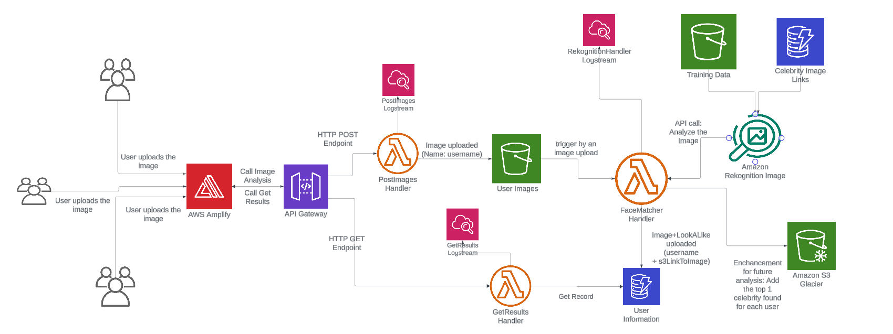

### Celebrity Lookalike 
This is a serverless AWS project that will set up a complete pipeline where a user can take a photo of themselves and find
which celebrity they look like the most. 

## Architecture
Here is the architecture of the project:

It leverages Amplify for hosting the FrontEnd, analyses the images using AWS Rekognition API, and utilizes the combination of 
Lambdas and API Gateway to provide a serverless project. 

## Pre-requisites
1. AWS Free-Tier account
2. Runnable terraform setup, either via configuring aws cli and installing terraform locally, or running it through CloudShell. 

## Terraform
Terraform is leveraged in this app to build and destroy the pipeline seamlessly. In order to use the script in Terraform\Setup:
1. ensure Terraform is configured correctly wherever you are running it
2. change the locals variable to fit your name in main.tf
3. run "terraform plan". You should see 205 objects sbeing planned to create. If so, proceed with "terraform apply". 

Currently, Terraform deploys to Amplify by pulling the code from this repository. If you wish to update the UI, feel free to fork the repo, update the link in main.tf "amplify_app" resource accordingly, and edit the UI. Amplify will immediately deploy the most recent version of the app, allowing for a quick testing setup.

If changes are made to lambdas in their respective folders, they need to be copied into TF Setup.

### Destroying
terraform destroy removes most objects apart from the S3 bucket user-images bucket and the S3 Glacier. The user images bucket must be manually emptied and deleted, whereas S3 Glacier is destroyed on a scheduled basis.

## TODO:
1. Update the file name and terraform resource name convention to make the code more readable.
